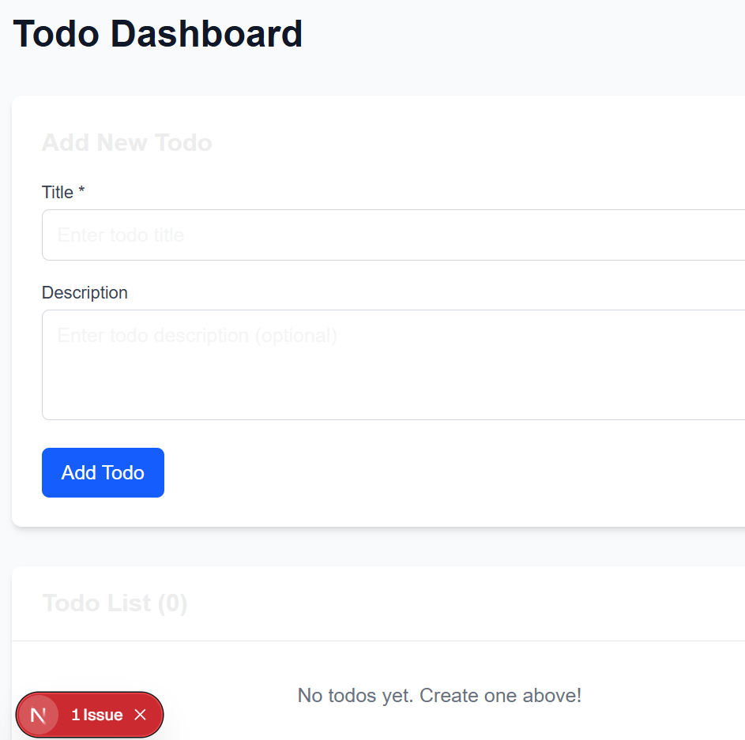

# AI コーディングガイド

## 実践的な AI ペアプログラミングガイド

AI アシスタント（Claude Code / Cline）と効果的に協働する方法を実践的に学ぶプロジェクト集です。

速習 Claude Code を読むことを前提

https://zenn.dev/mizchi/articles/claude-code-cheatsheet

## プロジェクト構成

```
ai-coding-guide/
├── guides/          # 各プロジェクトのガイド
│   ├── 00-setup.md
│   ├── 01-dijkstra.md
│   ├── 02-todo.md
│   ├── 03-ink-game.md
│   ├── 04-mcp.md
│   ├── 05-survivor-game.md
│   ├── 06-typechecker.md
│   └── 07-real-world.md
├── examples/        # 実装例
│   ├── 00-setup/
│   ├── 01-dijkstra/
│   ├── 02-todo/
│   ├── 03-ink-game/
│   ├── 04-mcp/
│   ├── 05-survivor-game/
│   ├── 06-typechecker/
│   └── 07-real-world/
```

### このプロジェクトの設計

- README.md : このドキュメント。最初に指示したプロンプトが残されています。
- `guides/*.md` は初期プロンプトからそこから AI が書いた設計ガイド
- `examples/*/...` はそのガイドから Claude 4 Opus で生成されたガイド

注意点として、このリポジトリをそのまま使って `guides/*` をなぞらせても、**AI が生成済みのコードから出力(例)を覗いてしまうので、機能しません!**

なので、自分で試したい方は `examples/*` を削除してしまうことを推奨します。

```bash
git clone https://github.com/mizchi/ai-coding-guide-202507
cd ai-coding-guide-202507

## 出力例を削除
git rm -r examples
git commit -m "delete examples/*"
git switch -c playground # playground ブランチを作成して、そこで作業
```

あくまで既存の `examples/*` は出力サンプルの一つでしかないことを理解してください。LLM の出力は確実に再現するものではありません。

### 🎯 目的

- AI アシスタントと効果的に協働する方法を学ぶ
- 今の AI に対して、期待値をコントロールできるようになること
- AI の得意・不得意を理解し、適切な指示を出せるようになること

---

以下、プロンプトと実際に出力される対象から学ぶことを述べる。

これが良いプロンプトというわけではなく、とりあえずやらせてみて、それを方向修正していく、というフローなのに注意。

## 各プロジェクトの作成指示

### 00-setup: 環境構築

**指示**:

```
このプロジェクトでは、AIコーディングのためのトレーニング教材やデモを作成します。最初のものを作ります。

最初に作るものは examples/00-setup です。ESModuleでvitestが実行できる設定を構築してください。src/index.test.ts を作成してpnpm test が動作することを確認して。README.md にユーザーがその状態まで辿り着けるステップを記述してください。

guides/00-setup.md は claude-code または vscode+cline のセットアップ手順を含みます。
```

**結果**: TypeScript + Vitest の基本的なプロジェクトセットアップが済むこと

**学べること**: AI に対する自動テストの有用性。また、TS の環境構築は鬼門で、かなり細かく指示しないとセットアップ方法が発散する。よく知られているものを優先的に選ぶことで、成功率が上がる。

**発展編**: fizzbuzz 関数を追加したり、テストコードを追加したりしてみよう。

### 01-dijkstra: アルゴリズム実装

**指示**:

```
01-dijkstra.md を作ろう。ネットワーク上の経路を探索するアルゴリズムを書いてみよう。

人間用にサンプルのネットワークを mermaidのグラフ記法で記述して、そレに対してダイクストラ法で経路探索を行う。

vitest でテストをする。
```

**結果**: ダイクストラ法による最短経路探索アルゴリズムの実装とテスト
**学べること**: AI はよく知られたアルゴリズムが得意で、人間が追いつかない。しかし、グラフ表現といっても単方向、双方向、重み付き、グリッドと `A*` による重み付き等が実は色々ある。そこを指示しないと、適当に実装し始める。

**発展的なゴール** arxiv から適当なペーパーを拾ってきて、それを AI に食わせて、生成さてみよう

応用例: https://github.com/mizchi/readability

### 02-todo: データベースアプリケーション

**指示**:

1.

```markdown
<!-- 指示 -->

02-todo を作成する。node:24 node:sqlite で CRUD API を作成し、vitest でそのテストを書く。また、その CLI を作る。
```

2.

```
次に、 src_v2 を作って、prisma ORM で、同じ sqlite を構造化して型がついたAPIで操作できるようにする。
```

**結果**: node:sqlite を使った Todo アプリ CLI、後に Prisma への移行させる。
**学ぶこと**: CRUD という基本で DB を使ったアプリの原型を作らせてみる。 LLM は SQL が比較的得意で、転移学習によって Prisma との整合性も比較的取れる。ライブラリを移行するという体験をする。

### 03-ink-game: ターミナルゲーム

**指示**:

```
React Ink で ローグライクゲームを作る。@ でプレーヤーを可視化。グリッド10x10で、X がプレイヤーとし、移動すると座標が変わる。

01-dijkstra のアルゴリズムを使う形で、敵がプレーヤーに向かって歩いてくるように実装しよう。敵は # で、最初に 4,8 に配置。プレイヤーは 0,0からスタート、ダイクストラ法を使ってプレーヤーに1ターンごとに近づく
```

**結果**: React Ink でクリッカーゲームからローグライクゲームへ発展、ダイクストラ法を敵 AI に活用
**学べること**: AI はデータモデルがきっちり決まってるものへの対応が強い。本格的なウェブ UI を作る前に、簡易な TUI でローグライクゲームを作ることで、AI が得意な範囲で複雑なデータモデルを

**発展的なゴール**: ローグライクゲームとして発展させる、 ink-testing-libarary でテストを書く、セーブデータを JSON で保存する、など

応用例 https://github.com/mizchi/vibe-hack-and-slash

### 04-mcp: MCP サーバー実装

**指示**:

```
04-mcp を作る。Claude Code で扱える MCPをサーバー自体を自分で作る。
簡単なエコーサーバーを作ろう。

mcp を生成するときには簡単エコーサーバーと MCP クライアントをセットで生成する。
```

**結果**: Model Context Protocol サーバー

**学べること**: MCP とは何なのか知り、AI に使わせるツールを自作するのは難しくない、ということを知る。

```json
{
  "mcpServers": {
    "echo": {
      "command": "node",
      "args": ["dist/server.js"]
    }
  }
}
```

```bash
$ claude --mcp-config=.mcp.json # 一時的な mcpServers 設定を使用
> /mcp

╭─────────────────────────────────────────────────────────────────────────╮
│ Manage MCP servers                                                      │
│                                                                         │
│ ❯ 1. echo            ✔ connected · Enter to view details                │
╰─────────────────────────────────────────────────────────────────────────╯

> use echo mcp
● I'll use the echo MCP tool to echo back a message.

● echo:echo (MCP)(message: "Hello from MCP echo tool!")
  ⎿  Echo: Hello from MCP echo tool!

● MCPのechoツールを使ってメッセージをエコーバックしました。このツール
  は送信したメッセージをそのまま返す機能を持っています。

  他にMCPツールを試したり、何か作業をお手伝いできることがあれば教えて
  ください。
```

応用例 https://github.com/mizchi/lsmcp

### 05-survivor-game: React + SVG ゲーム

**指示**:

```
05-suvivor-game を作る。React + SVG で Vampire Survivor みたいなゲームを作る。vite + react + SVG を使う。

簡単なゲーム仕様: 全方位から敵が迫ってくる。SVGのクリップでカメラ操作をする。プレーヤーから自動で弾が発射され、敵を倒すと経験値が落ちる。経験値を拾ってレベルアップして、弾数や、弾の威力、弾の飛距離がランダムで強化される。

カーソルキーで移動できるようにする。カメラは常にプレーヤーを中心にする。
```

**結果**: Vampire Survivors 風の全方位シューティングゲーム、SVG でグラフィックス実装

**学べること**: GUI は人間が挟まるので、とにかく安定しない。

### 06-typechecker: 型チェッカーの実装

**指示**:

```
06-typechecker を追加しよう。型チェッカーとHM型推論をTypeScriptで実装する
```

**結果**: Hindley-Milner 型推論アルゴリズムを実装した型チェッカー、let 多相をサポート
**学べること**: とにかく難しくても歴史があり作例が多ければ対応可能だが、人間側がその正しさを検証するハードルが上がる。

### 07-real-world: 実践的なプロジェクト

**指示**:

1

```
07-real-world を追加する。 02-todo の prisma をベースとするが、 CLAUDE.md で綿密にプロンプトを記述して、oxlint で linter や github workflow を記述する。
```

2

```
next.js でTODOを操作できるダッシュボードを作る
```

3

```
playwright を導入して、ユニットテスト出来るようにする。
```

**結果**: 今までの発展型。CLAUDE.md による詳細プロンプト、oxlint によるコード品質管理、GitHub Actions による CI/CD を含む実践的なプロジェクト。



**学べること**: データモデルに対して、GUI は人間が確認が必要になり検証ループが低速になる。そのために playwright E2E のような自動化が必要になってしまう。

**発展編**: playwright-mcp を入れて、ヘッドレスブラウザで動作確認させてみよう。

https://github.com/microsoft/playwright-mcp

---

以下 AI 自身に述べさせた、良い指示の出し方。

## 学習のポイント

### AI が得意なこと

- 既知の仕様の参照やアルゴリズム実装（Web 標準、ソートアルゴリズムなど）
- 仕様が明確で、データ構造やテストが充実した環境での自動コーディング
- カバレッジ目標の設定など、明確な指示がある中でのコーディング

### AI が苦手なこと

- 環境セットアップ（ハルシネーションしやすい）
- GUI の視覚的な調整（フィードバックループが必要）
- 最新の API や仕様（学習データが古い場合）

### 効果的な指示の出し方

1. **具体的で段階的な指示**: 大きなタスクを小さく分割
2. **コンテキストの提供**: 使用する技術スタックを明確に
3. **エラーの正確な報告**: 「動かない」ではなく具体的な症状を
4. **参考資料の提示**: 公式ドキュメントの URL など

## 💡 AI コーディングの基本原則

### 1. 明確で具体的な指示

```
❌ 悪い例: "関数を作って"
✅ 良い例: "src/math.tsにadd(a: number, b: number): numberを実装して"
```

NOTE: 型シグネチャを指示できるのがベストだが、AI がそれに従うかは怪しい。

### 2. 段階的なアプローチ

```
1. 小さなタスクに分割
2. 動作確認しながら進める
3. エラーが出たら原因を明確に伝える
```

いきなり大きなゴールを与えない。自分の中に再現可能な範囲がどこまでかを蓄積する。

### 3. コンテキストの提供

```
- 使用する技術スタック
- プロジェクトの構造
- 期待する動作
```

### 4. フィードバックループを設計する

```
1. 指示を出す
2. 結果を確認
3. エラーがあれば修正を指示
4. 動作確認
```

### 3. 段階的な複雑性

- シンプルな実装から始める
- 動作を確認しながら機能追加
- リファクタリングで品質向上

## 🎯 まとめ

### AI コーディングで重要なこと

1. **明確な指示** - 曖昧さを避ける
2. **段階的開発** - 小さく始めて大きく育てる
3. **適材適所** - AI の得意・不得意を理解
4. **継続的改善** - フィードバックを活かす
